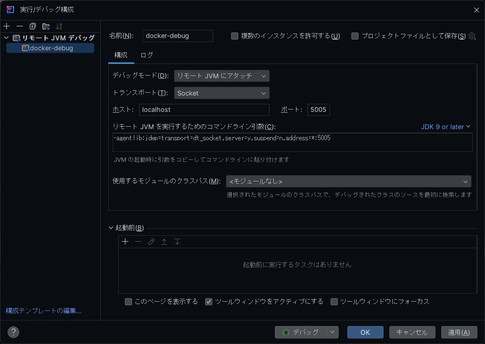

# flex-diary-root

`flex-diary-root`リポジトリは、`flex-diary-ui`（React製）と`flex-diary-api`（Spring Boot製）をサブモジュールとして統合したプロジェクトです。

## クローン方法

このリポジトリをクローンする際は、サブモジュールも同時にクローンする必要があります。以下のコマンドを使用してください：

```sh
git clone --recursive git@github.com:hiraoq/flex-diary-root.git
```

既にクローン済みのリポジトリにサブモジュールを取得する場合は、以下のコマンドを実行してください：

```sh
git submodule update --init --recursive
```

## 開発フロー

1. **リポジトリのクローン**
    ```sh
    git clone --recursive git@github.com:hiraoq/flex-diary-root.git
    cd flex-diary-root
    ```

2. **変更の反映**
    サブモジュールでの変更はそれぞれのディレクトリ内で行い、コミットを作成します。以下は例です。

    ### flex-diary-uiでの変更
    ```sh
    cd flex-diary-ui
    # 変更を行う
    git add .
    git commit -m "変更内容の説明"
    git push origin main
    ```

    ### flex-diary-apiでの変更
    ```sh
    cd flex-diary-api
    # 変更を行う
    git add .
    git commit -m "変更内容の説明"
    git push origin main
    ```

3. **サブモジュールの更新**
    サブモジュールに変更があった場合は、`flex-diary-root`リポジトリでも更新を行います。
    TODO:GithubActions等で自動化
    
    ```sh
    git submodule update --remote --merge
    git commit -am "Update submodules"
    git push origin main
    ```

## 注意点

1. **サブモジュールの管理**  
    サブモジュールとしているリポジトリを単独でクローンして、コミットやプッシュを行っても大丈夫です。
    ただしその後、できればflex-diary-rootリポジトリに戻ってサブモジュールの参照を最新に更新してプッシュしてください。
    これを行うことで、他の開発者がflex-diary-rootをクローンした際に最新のflex-diary-uiの変更が反映されます。 TODO:自動化

2. **サブモジュールの状態確認**  
    サブモジュールの状態を確認するには以下のコマンドを使用します：
    ```sh
    git submodule status
    ```

3. **サブモジュールのコミット漏れに注意**  
    サブモジュール内での変更をプッシュした後、`flex-diary-root`リポジトリのコミットを忘れないようにしてください。これを怠ると、他の開発者が最新の変更を取得できなくなります。

4. **サブモジュールの初期化忘れ**  
    本リポジトリをクローンする際、--recursiveを付けなかった場合は、クローン後にサブモジュールの初期化と更新を忘れないようにしてください。
    初期化を怠ると、サブモジュールの内容が正しく取得されません。
    ```sh
    git submodule update --init --recursive
    ```

これらの点に注意しながら、開発を進めてください。

## Dockerを使った開発とリモートデバッグ

このプロジェクトでは、`flex-diary-api`（Spring Boot製）をDockerコンテナ内で実行し、リモートデバッグを行うことができます。以下の手順に従って設定を行い、効率的な開発環境を構築してください。

### Dockerを使った`flex-diary-api`の起動

1. **Dockerイメージのビルドとコンテナの起動**

   `flex-diary-api`をDockerコンテナ内で実行するために、以下のコマンドを実行してDockerイメージをビルドし、コンテナを起動します。

   ```sh
   cd flex-diary-api
   docker-compose build
   docker-compose up
   ```

   この操作により、`flex-diary-api`がコンテナ内で起動します。

2. **ホットリロードと自動ビルド**

   開発中にコードを変更した場合、コンテナ内でホットリロードが有効になっているため、ビルドすると自動的に再起動が行われます。
   必要に応じてIDEで自動ビルドの設定をしてください。
### リモートデバッグの設定

リモートデバッグを行うために、以下の設定を行います。

1. **IntelliJ IDEAでのリモートデバッグ構成**

   IntelliJ IDEAで新しいデバッグ構成を作成し、以下の設定を行います。

   - **デバッグモード**: リモート JVM にアタッチ
   - **トランスポート**: Socket
   - **ホスト**: localhost
   - **ポート**: 5005

   デバッグ構成の例は以下の画像を参照してください。

   

2. **build.gradleでのデバッグオプション設定**

   `build.gradle`の`bootRun`タスクで、以下のようにデバッグオプションを直接指定しています。これにより、デバッグオプションがアプリケーションプロセスにのみ適用され、不要なプロセスへの影響を避けています。

   ```groovy
   bootRun {
       jvmArgs = ["-agentlib:jdwp=transport=dt_socket,server=y,suspend=n,address=*:5005"]
   }
   ```

3. **リモートデバッグの開始**

   IntelliJ IDEAでリモートデバッグ構成を選択し、「デバッグ」ボタンを押します。これにより、コンテナ内の`flex-diary-api`に接続し、デバッグを行うことができます。
